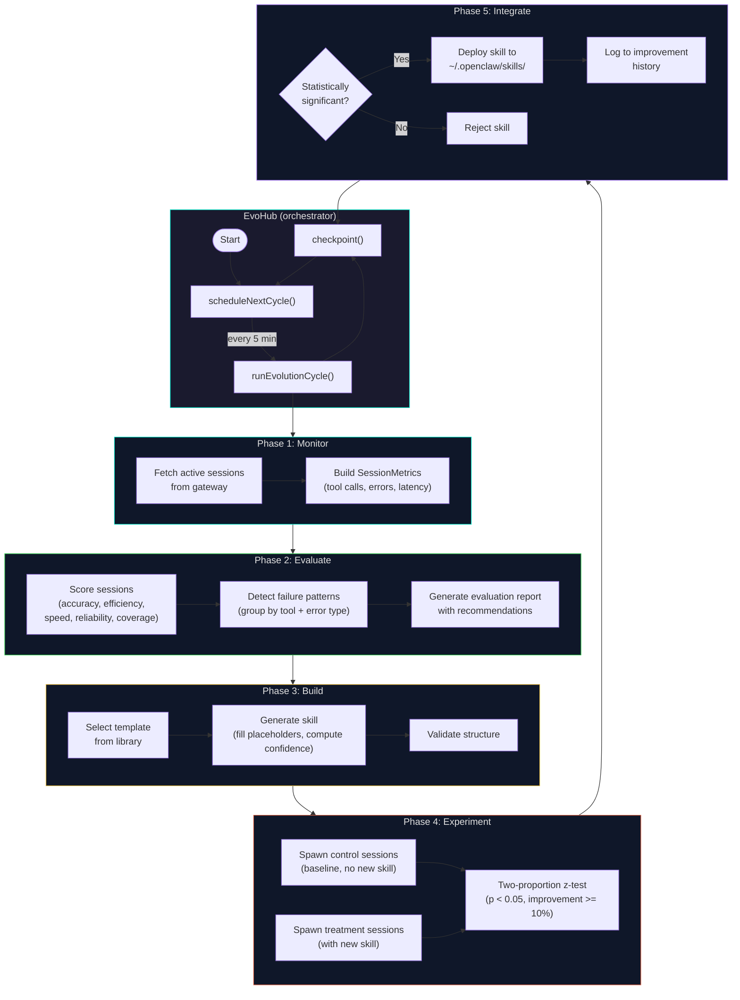
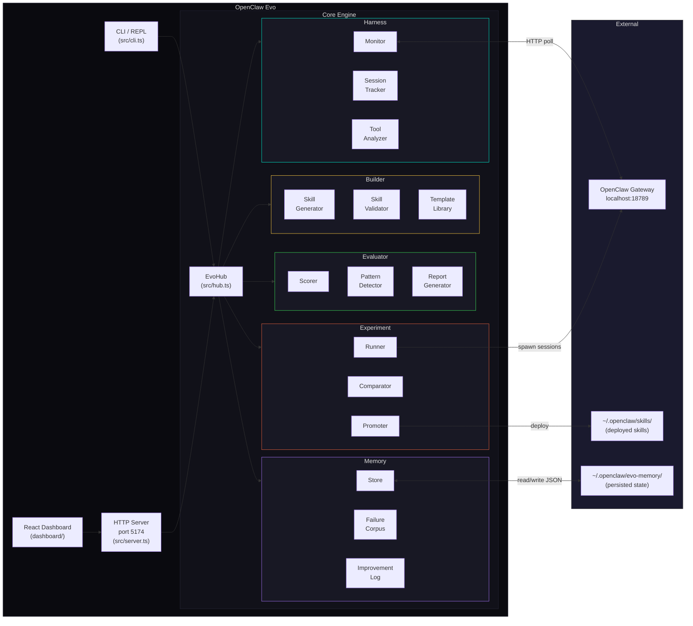
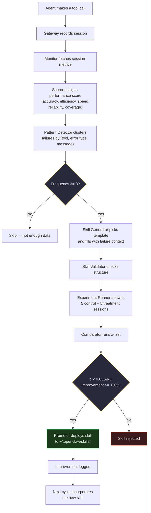
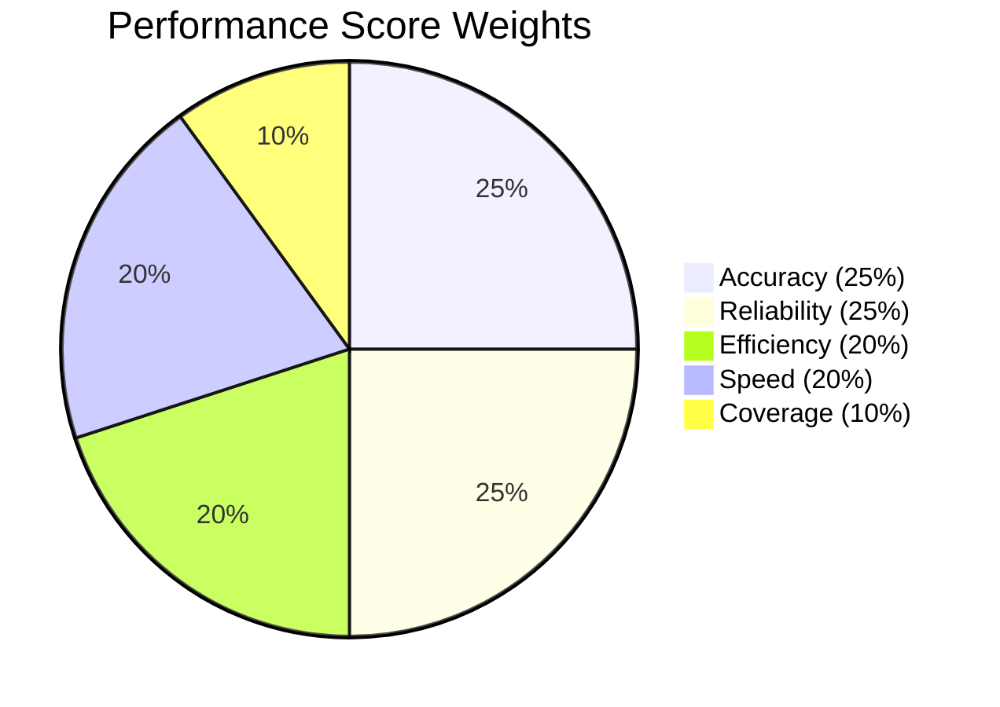
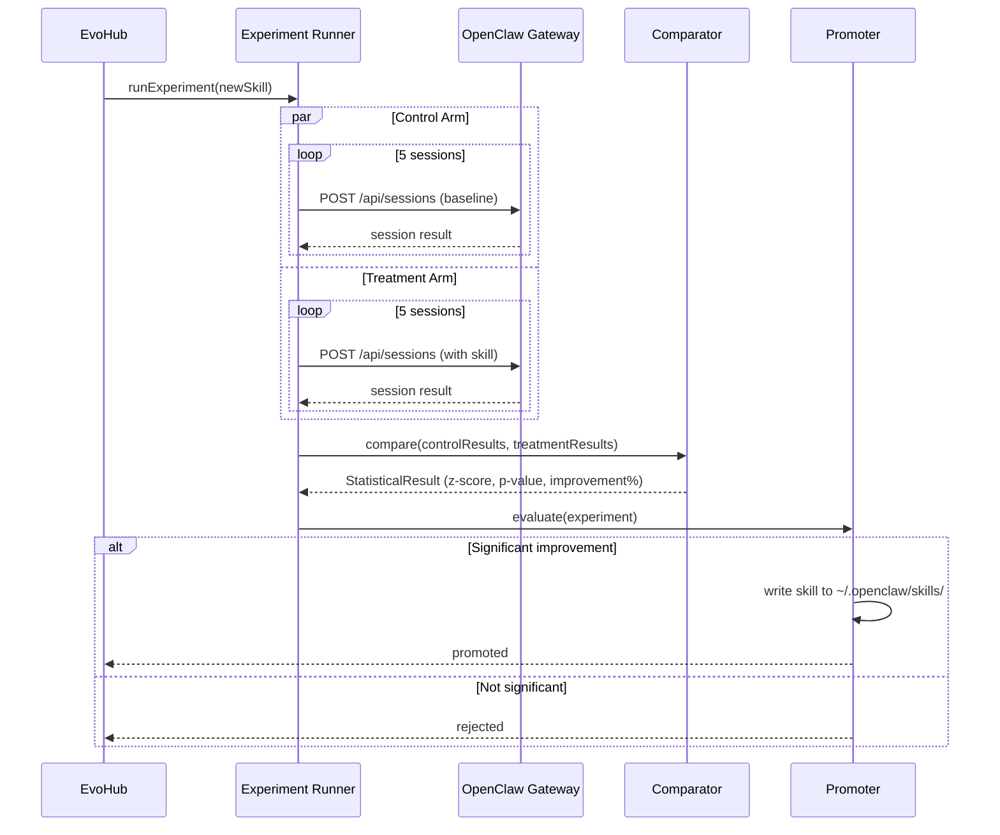

# OpenClaw Evo — System Diagram

## Evolution Loop

```mermaid
flowchart TB
    subgraph Hub["EvoHub (orchestrator)"]
        direction TB
        Start([Start]) --> Schedule["scheduleNextCycle()"]
        Schedule -->|"every 5 min"| Cycle["runEvolutionCycle()"]
        Cycle --> Checkpoint["checkpoint()"]
        Checkpoint --> Schedule
    end

    subgraph Phase1["Phase 1: Monitor"]
        M1["Fetch active sessions\nfrom gateway"]
        M2["Build SessionMetrics\n(tool calls, errors, latency)"]
        M1 --> M2
    end

    subgraph Phase2["Phase 2: Evaluate"]
        E1["Score sessions\n(accuracy, efficiency,\nspeed, reliability, coverage)"]
        E2["Detect failure patterns\n(group by tool + error type)"]
        E3["Generate evaluation report\nwith recommendations"]
        E1 --> E2 --> E3
    end

    subgraph Phase3["Phase 3: Build"]
        B1["Select template\nfrom library"]
        B2["Generate skill\n(fill placeholders, compute confidence)"]
        B3["Validate structure"]
        B1 --> B2 --> B3
    end

    subgraph Phase4["Phase 4: Experiment"]
        X1["Spawn control sessions\n(baseline, no new skill)"]
        X2["Spawn treatment sessions\n(with new skill)"]
        X3["Two-proportion z-test\n(p < 0.05, improvement >= 10%)"]
        X1 --> X3
        X2 --> X3
    end

    subgraph Phase5["Phase 5: Integrate"]
        I1{"Statistically\nsignificant?"}
        I2["Deploy skill to\n~/.openclaw/skills/"]
        I3["Log to improvement\nhistory"]
        I4["Reject skill"]
        I1 -->|"Yes"| I2 --> I3
        I1 -->|"No"| I4
    end

    Cycle --> Phase1
    Phase1 --> Phase2
    Phase2 --> Phase3
    Phase3 --> Phase4
    Phase4 --> Phase5
    Phase5 --> Checkpoint

    style Hub fill:#1a1a2e,stroke:#00e5c8,color:#e0e0e0
    style Phase1 fill:#0f1729,stroke:#00e5c8,color:#e0e0e0
    style Phase2 fill:#0f1729,stroke:#39d353,color:#e0e0e0
    style Phase3 fill:#0f1729,stroke:#f0c040,color:#e0e0e0
    style Phase4 fill:#0f1729,stroke:#e06040,color:#e0e0e0
    style Phase5 fill:#0f1729,stroke:#a070f0,color:#e0e0e0
```

## System Architecture

```mermaid
flowchart LR
    subgraph External["External"]
        GW["OpenClaw Gateway\nlocalhost:18789"]
        Skills["~/.openclaw/skills/\n(deployed skills)"]
        Disk["~/.openclaw/evo-memory/\n(persisted state)"]
    end

    subgraph Evo["OpenClaw Evo"]
        direction TB

        CLI["CLI / REPL\n(src/cli.ts)"]
        Server["HTTP Server\nport 5174\n(src/server.ts)"]
        Dashboard["React Dashboard\n(dashboard/)"]

        subgraph Core["Core Engine"]
            HUB["EvoHub\n(src/hub.ts)"]

            subgraph Harness["Harness"]
                MON["Monitor"]
                ST["Session\nTracker"]
                TA["Tool\nAnalyzer"]
            end

            subgraph Eval["Evaluator"]
                SC["Scorer"]
                PD["Pattern\nDetector"]
                RG["Report\nGenerator"]
            end

            subgraph Build["Builder"]
                SG["Skill\nGenerator"]
                SV["Skill\nValidator"]
                TL["Template\nLibrary"]
            end

            subgraph Exp["Experiment"]
                RN["Runner"]
                CMP["Comparator"]
                PR["Promoter"]
            end

            subgraph Mem["Memory"]
                MS["Store"]
                FC["Failure\nCorpus"]
                IL["Improvement\nLog"]
            end
        end

        CLI --> HUB
        Server --> HUB
        Dashboard --> Server

        HUB --> Harness
        HUB --> Eval
        HUB --> Build
        HUB --> Exp
        HUB --> Mem
    end

    MON <-->|"HTTP poll"| GW
    RN -->|"spawn sessions"| GW
    PR -->|"deploy"| Skills
    MS <-->|"read/write JSON"| Disk

    style Evo fill:#0a0a0f,stroke:#252535,color:#e0e0e0
    style Core fill:#111119,stroke:#252535,color:#e0e0e0
    style Harness fill:#181824,stroke:#00e5c8,color:#e0e0e0
    style Eval fill:#181824,stroke:#39d353,color:#e0e0e0
    style Build fill:#181824,stroke:#f0c040,color:#e0e0e0
    style Exp fill:#181824,stroke:#e06040,color:#e0e0e0
    style Mem fill:#181824,stroke:#a070f0,color:#e0e0e0
    style External fill:#1a1a2e,stroke:#444,color:#e0e0e0
```

## Data Flow (failure to fix)

```mermaid
flowchart TD
    A["Agent makes a tool call"] --> B["Gateway records session"]
    B --> C["Monitor fetches session metrics"]
    C --> D["Scorer assigns performance score\n(accuracy, efficiency, speed,\nreliability, coverage)"]
    D --> E["Pattern Detector clusters\nfailures by (tool, error type, message)"]
    E --> F{"Frequency >= 3?"}
    F -->|"No"| G["Skip — not enough data"]
    F -->|"Yes"| H["Skill Generator picks template\nand fills with failure context"]
    H --> I["Skill Validator checks structure"]
    I --> J["Experiment Runner spawns\n5 control + 5 treatment sessions"]
    J --> K["Comparator runs z-test"]
    K --> L{"p < 0.05 AND\nimprovement >= 10%?"}
    L -->|"Yes"| M["Promoter deploys skill\nto ~/.openclaw/skills/"]
    L -->|"No"| N["Skill rejected"]
    M --> O["Improvement logged"]
    O --> P["Next cycle incorporates\nthe new skill"]

    style F fill:#2a2a3e,stroke:#f0c040,color:#e0e0e0
    style L fill:#2a2a3e,stroke:#f0c040,color:#e0e0e0
    style M fill:#1a3a1a,stroke:#39d353,color:#e0e0e0
    style N fill:#3a1a1a,stroke:#e06040,color:#e0e0e0
```

## Scoring Dimensions

```mermaid
pie title Performance Score Weights
    "Accuracy (25%)" : 25
    "Reliability (25%)" : 25
    "Efficiency (20%)" : 20
    "Speed (20%)" : 20
    "Coverage (10%)" : 10
```

## Experiment A/B Testing

```mermaid
sequenceDiagram
    participant Hub as EvoHub
    participant Runner as Experiment Runner
    participant GW as OpenClaw Gateway
    participant Comp as Comparator
    participant Prom as Promoter

    Hub->>Runner: runExperiment(newSkill)

    par Control Arm
        loop 5 sessions
            Runner->>GW: POST /api/sessions (baseline)
            GW-->>Runner: session result
        end
    and Treatment Arm
        loop 5 sessions
            Runner->>GW: POST /api/sessions (with skill)
            GW-->>Runner: session result
        end
    end

    Runner->>Comp: compare(controlResults, treatmentResults)
    Comp-->>Runner: StatisticalResult (z-score, p-value, improvement%)
    Runner->>Prom: evaluate(experiment)

    alt Significant improvement
        Prom->>Prom: write skill to ~/.openclaw/skills/
        Prom-->>Hub: promoted
    else Not significant
        Prom-->>Hub: rejected
    end
```
